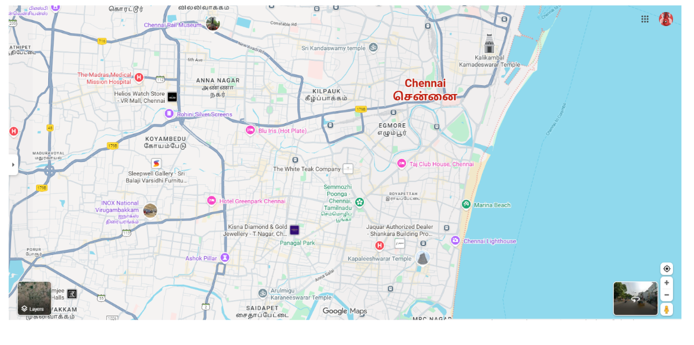

# Ex04 Places Around Me
## Date: 09-10-2025

## AIM
To develop a website to display details about the places around my house.

## DESIGN STEPS

### STEP 1
Create a Django admin interface.

### STEP 2
Download your city map from Google.

### STEP 3
Using ```<map>``` tag name the map.

### STEP 4
Create clickable regions in the image using ```<area>``` tag.

### STEP 5
Write HTML programs for all the regions identified.

### STEP 6
Execute the programs and publish them.

## CODE
```
map.html
<!DOCTYPE html>
<html lang="en">
<head>
    <meta charset="UTF-8">
    <meta name="viewport" content="width=device-width, initial-scale=1.0">
    <title>Document</title>
</head>
<body>
<h1 align="center">
    <font color="RED"><b>CHENNAI</b></font>
</h1>
<h3 align="center">
    <font color="blue"><b>ARJUN R S (25017547)</b></font>

</h3>
<CENTER>


<map name="image-map">
    <area target="" alt="kalikambal temple" title="kalikambal temple" href="C:\Users\acer\image\NearMe\Arjun\mapapp\static\kalikambal temple.html" coords="1259,58,1471,209" shape="rect">
    <area target="" alt="Rohini silver screens" title="Rohini silver screens" href="C:\Users\acer\image\NearMe\Arjun\mapapp\static\Rohini.html" coords="428,273,662,375" shape="rect">
    <area target="" alt="chennai rail museum" title="chennai rail museum" href="C:\Users\acer\image\NearMe\Arjun\mapapp\static\chennai rail museum.html" coords="334,21,674,99" shape="rect">
    <area target="" alt="kapaleeshwarar temple" title="kapaleeshwarar temple" href="C:\Users\acer\image\NearMe\Arjun\mapapp\static\kapaleeshwarar.html" coords="940,696,1217,755" shape="rect">
    <area target="" alt="Marina beach" title="Marina beach" href="C:\Users\acer\image\NearMe\Arjun\mapapp\static\Marina beech.html" coords="1369,451,1265,633" shape="rect">
</map>
</CENTER>
</body>
</html>


Rohini.html

<!DOCTYPE html>
<html lang="en">
<head>
    <meta charset="UTF-8">
    <meta name="viewport" content="width=device-width, initial-scale=1.0">
    <title>Document</title>
</head>
<body bgcolor="purple">
    <center>
    

<h1>ROHINI THEATRE</h1>
<p>Rohini Silver Screens is a prominent multiplex cinema located in Koyambedu, Chennai, India. Originally founded in the 1990s, it has been renovated with modern amenities to provide a high-quality movie-watching experience. </p>

</center>

</body>
</html>

kalikambal.html

<!DOCTYPE html>
<html lang="en">
<head>
    <meta charset="UTF-8">
    <meta name="viewport" content="width=device-width, initial-scale=1.0">
    <title>Document</title>
</head>
<body bgcolor="yellow">
 <center>
    
  <h1>KALIKAMBAL TEMPLE</h1> 
  <p>The Arulmigu Kalikambal Temple in Chennai is a historic and significant Hindu temple located in the busy George Town area. The temple, dedicated to the goddesses Kalikambal (a form of Parvati/Kamakshi) and Kamateswarar (a form of Shiva), has a rich history and Dravidian architecture. </p> 
 </center>
</body>
</html>

Marina.html

<!DOCTYPE html>
<html lang="en">
<head>
    <meta charset="UTF-8">
    <meta name="viewport" content="width=device-width, initial-scale=1.0">
    <title>Document</title>
</head>
<body bgcolor="green">
    <center>
        
        <h1>MARINA BEECH</h1>
        <p>Marina Beach is a long, natural sandy urban beach in Chennai, Tamil Nadu, India, and is one of the longest urban beaches in the world. This bustling destination on the Bay of Bengal shoreline is known for its spectacular sunrises and sunsets, lively atmosphere, and rich cultural significance.</p>
    </center>
</body>
</html>

kapaleeshwarar.html

<!DOCTYPE html>
<html lang="en">
<head>
    <meta charset="UTF-8">
    <meta name="viewport" content="width=device-width, initial-scale=1.0">
    <title>Document</title>
</head>
<body bgcolor="red">
    <center>
      
      <h1>KAPALEESHWARAR TEMPLE</h1> 
      <p>The Kapaleeshwarar Temple is a prominent Hindu shrine in Mylapore, Chennai, dedicated to Lord Shiva and Goddess Karpagambal (Parvati). Its magnificent Dravidian architecture, with towering gopurams and colorful sculptures, attracts both devotees and tourists. </p> 
    </center>
</body>
</html>

chennai rail museum.html

<!DOCTYPE html>
<html lang="en">
<head>
    <meta charset="UTF-8">
    <meta name="viewport" content="width=device-width, initial-scale=1.0">
    <title>Document</title>
</head>
<body bgcolor="blue">
    <center>
        
        <h1>CHENNAI RAIL MUSEUM</h1>
        <p>The Chennai Rail Museum showcases the rich history and heritage of Indian Railways and is an excellent attraction for families and train enthusiasts. Managed by the Integral Coach Factory (ICF), the museum is located in the Perambur area of Chennai.</p>
    </center>
</body>
</html>

```
## OUTPUT



## RESULT
The program for implementing image maps using HTML is executed successfully.
